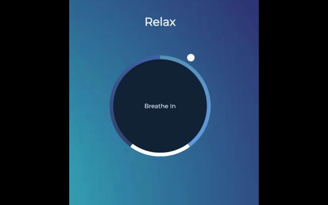

# 

## Description

In this day and age, it can be difficult to find time to take a breather. Relax, a breathing application, allows you to reorient yourself, calmly and discreetly, with a visual director to tell you when to breathe in, hold, and breathe out.



## Table of Contents

- [Technologies](#technologies)
- [Work In Progress](#work-in-progress)
- [Usage](#usage)

## Technologies


- HTML
- CSS
  - Keyframes and Animations
- JavaScript

## Work In Progress

- A 60-second countdown timer
  - Start and restart buttons that begin countdown
  - Animation begins when buttons are clicked rather than on page load

## Usage

- [Github Pages](https://bridgetrshannon.github.io/Relax/)
- [GitHub](https://github.com/bridgetrshannon/Relax)

```
git clone https://github.com/bridgetrshannon/Relax.git
```
